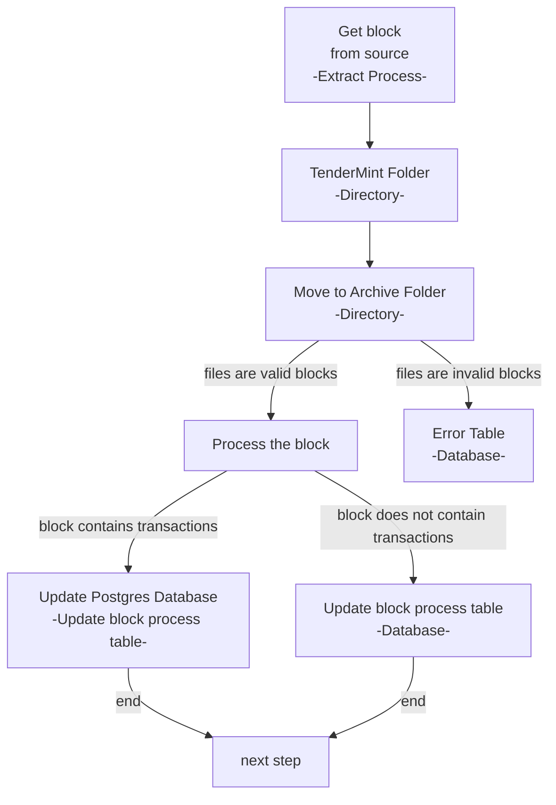

```mermaid
flowchart TD
A[Get block<br>from source<br>-Extract Process-]
A --> B
B[TenderMint Folder<br>-Directory-]
B --> C[Move to Archive Folder<br>-Directory-]
C -- files are valid blocks --> D
D[Process the block]
C -- files are invalid blocks --> E
E[Error Table<br>-Database-]
F[Update Postgres Database<br>-Update block process table-]
D -- block contains transactions --> F
D -- block does not contain transactions --> G
G[Update block process table<br>-Database-]
H[next step]
F -- end --> H
G -- end --> H
```
