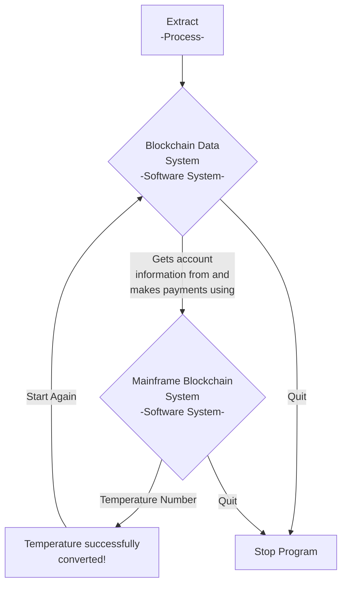

```mermaid
flowchart TD
A[Extract<br>-Process-] -->B{Blockchain Data<br>System<br>-Software System-}
B -- Gets account<br>information from and<br>makes payments using --> C{Mainframe Blockchain<br>System<br>-Software System-} 
C -- Temperature Number --> D[Temperature successfully<br>converted!] 
D -- Start Again -->B
B -- Quit --> E[Stop Program]
C -- Quit --> E
```
