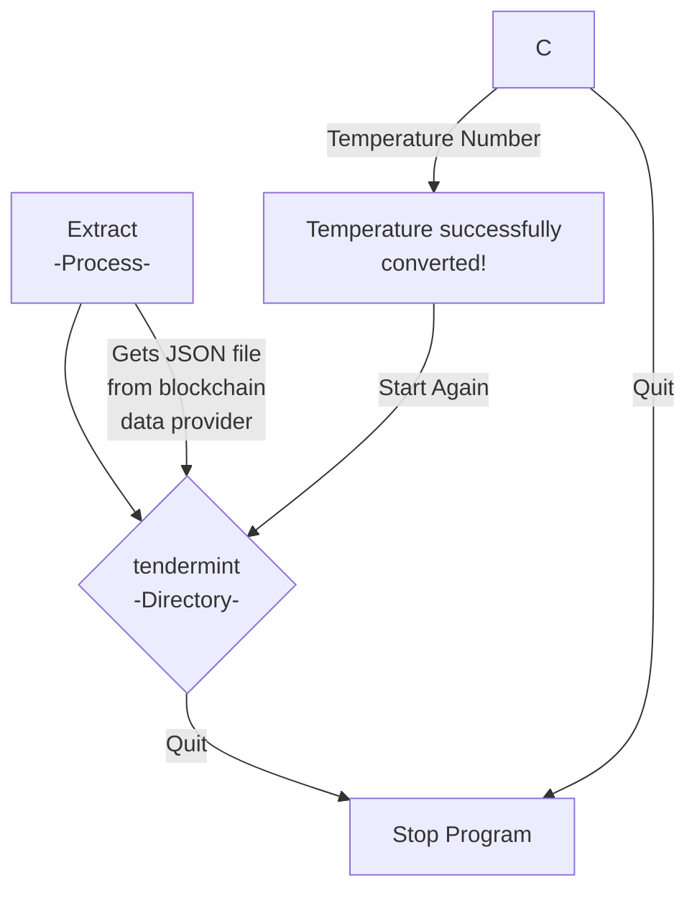

```mermaid
flowchart TD
A[Extract<br>-Process-] -->B{tendermint<br>-Directory-<br>-external system-}
A -- Gets JSON file<br>from blockchain<br>data provider -->B{tendermint<br>-Directory-}
C -- Temperature Number --> D[Temperature successfully<br>converted!] 
D -- Start Again -->B
B -- Quit --> E[Stop Program]
C -- Quit --> E
```
