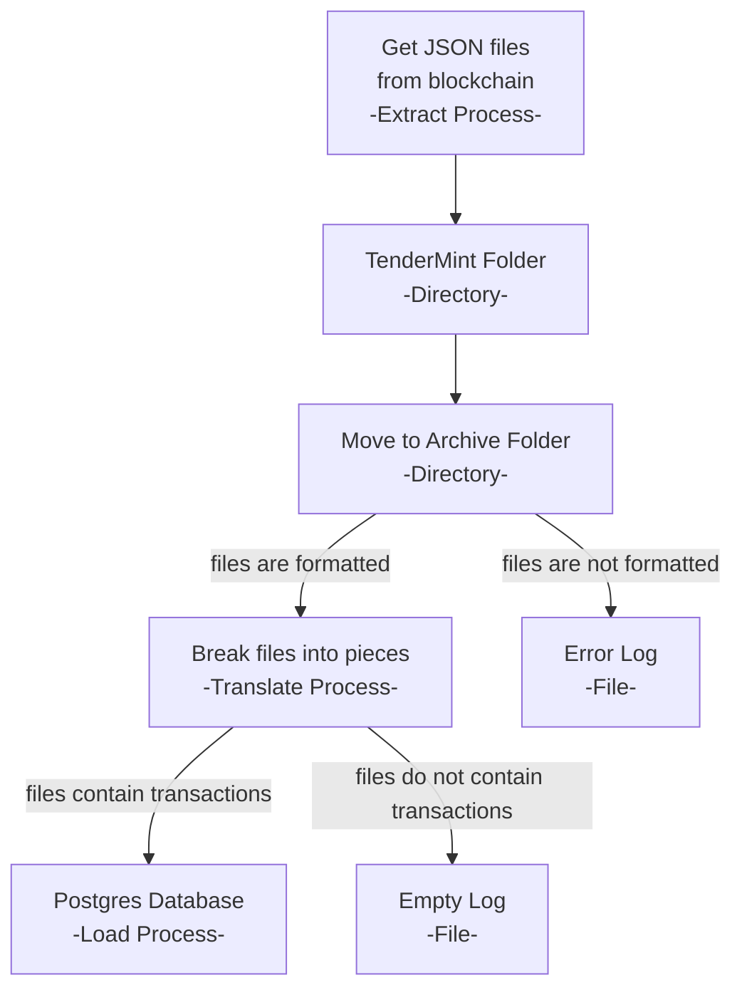

```mermaid
flowchart TD
A[Get JSON files<br>from blockchain<br>-Extract Process-]
A --> B
B[TenderMint Folder<br>-Directory-]
B --> C[Move to Archive Folder<br>-Directory-]
C -- files are formatted --> D
D[Break files into pieces<br>-Translate Process-]
C -- files are not formatted --> E
E[Error Log<br>-File-]
F[Postgres Database<br>-Load Process-]
D -- files contain transactions --> F
D -- files do not contain transactions --> G
G[Empty Log<br>-File-]
```
