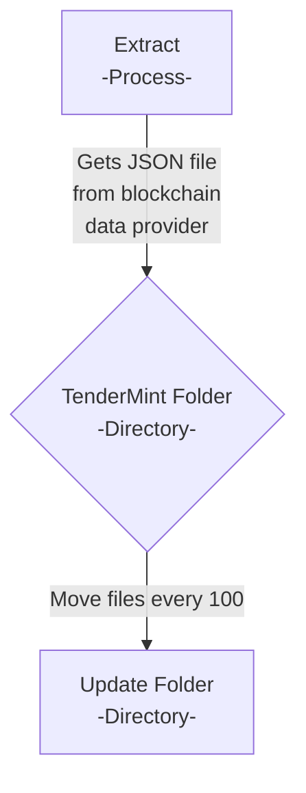

```mermaid
flowchart TD
A[Extract<br>-Process-]
A -- Gets JSON file<br>from blockchain<br>data provider --> B
B{TenderMint Folder<br>-Directory-}
B -- Move files every 100 --> C[Update Folder<br>-Directory-]
```
