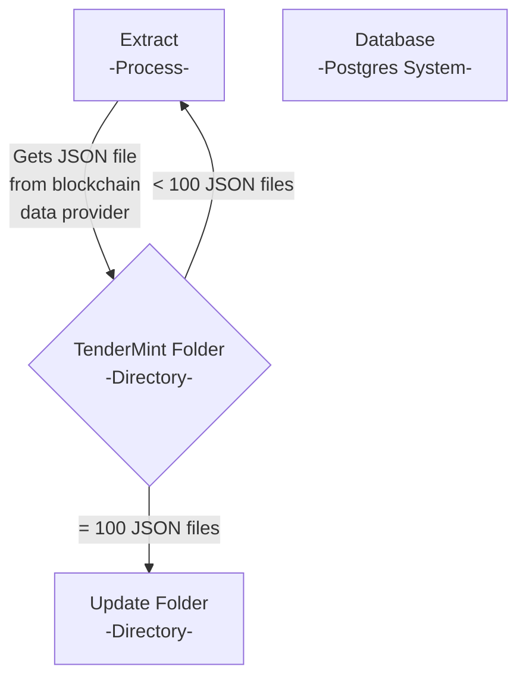

```mermaid
flowchart TD
A[Extract<br>-Process-]
A -- Gets JSON file<br>from blockchain<br>data provider --> B
B{TenderMint Folder<br>-Directory-}
B -- = 100 JSON files --> C[Update Folder<br>-Directory-]
B -- < 100 JSON files --> A
D[Database<br>-Postgres System-]
```
